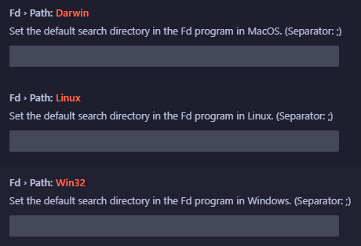

# FindSuite (RipGrep, Fd, Everything [Windows])

## Overview

VS Code already provides excellent file and text search capabilities, but it offers some minor inconvenience when searching for folders (directories) or text that exist beyond the workspace folder.

It helps you quickly and easily find files by integrating with the powerful Everything program to search for all folders or files existing in the system, including the workspace. (This is because it is a program for Windows.)

On Linux/Mac, you can use fd as an alternative to alleviate some of the inconvenience.

It provides easy and fast search within VS Code by integrating with the powerful and convenient Ripgrep program for handling text in files.

While it cannot replace the powerful pipes of Linux/Mac, it allows you to use similar functionality to "fd | rg" (Ctrl+F7) or "everything | rg" (Ctrl+Alt+F10).

To search, press the shortcut key (e.g., Ctrl+Alt+F7 or Ctrl+F7) in the blank space or on the word you want to search. If on Windows, press Ctrl+Alt+F9 or Ctrl+F10.

[Korean_한국어](README_KO.md)

## Prerequisites

Before using this extension, ensure that you have the following prerequisites installed:

- **Everything program**: The extension relies on the Everything program for fast file searches. Make sure it is installed on your system.

- **VSCode Settings**: Please enter the Host and Port configured in the Everything program. Also, configure the Everything Config.

- **VSCode Settings for Fd**: Please enter the default directories to search in the Fd program. The delimiter is ;. For example, in a Windows environment, enter like this in Fd > Path: Win32: C:\workspace;D:\my-project;.

## Features

### FindSuite Program

It provides easy and fast searching in VS Code by integrating the powerful and convenient Ripgrep program for manipulating text in files. It helps you find files quickly and easily by linking with Everything, which is more powerful than anything else when it comes to finding fold

## Fd Integration

The extension seamlessly integrates with fd, allowing users to search for specific filename efficiently.

### Shortcuts for Fd

- **Ctrl + Alt + 9**: It searches and displays all files within the current project's directory, allowing you to select and open multiple files.
- **Ctrl + Alt + F7**: Search for files in both the directory designated as default and the directory of the current project
- **Ctrl + Alt + m**: Open multiple files within a directory searched using Fd.
- **Ctrl + Shift + F7**: It searches directories using Fd, then uses Ripgrep to search within the selected directory. (Like 'fd -d | rg')
- **Ctrl + k Ctrl + Shift + d**: Use Fd to search for files and compare the selected files (diff).

## Ripgrep Integration

The extension seamlessly integrates with ripgrep, allowing users to search for files containing specific strings efficiently.

### Shortcuts for Ripgrep

- **Ctrl + Alt + f**: Search for strings within the files in the current workspace using ripgrep.
- **Ctrl + Alt + 0**: Search for strings within the currently open file using ripgrep.

## Everything integration

Ultra-fast file search by indexing every file and folder on your system. Works with Everything to handle large numbers of files quickly and easily in VS Code.

### Shortcuts Keys (Requires Everything)

- **Ctrl + F10**: It uses Everything to search for files, then uses Ripgrep to search for strings within the selected files
- **Ctrl + Shift + F10**: It uses Everything to search for folders, then uses Ripgrep to search for strings within the selected folders
- **Ctrl + Alt + F9**: Search for files using Everything.
- **Ctrl + Alt + 4**: Search using Everything and open the selected folder(s).
- **Ctrl + Alt + Shift+ m**: Open multiple files within a directory searched using Everything.
- **Ctrl + Alt + Shift + w**: Use Everything to search for code-workspace files and open Workspace.
- **Ctrl + k Ctrl + Alt + d**: Use Everything to search for files and compare the selected files (diff).

## Usage

1. **Install Everything Program**: Ensure that the Everything program is installed on your system.
2. **Activate Extension**: Launch VS Code and activate the FindSuite extension.
3. **Perform File Search**:
   - Use the provided commands, shortcuts, or the VS Code command palette to initiate file searches.
   - Enter the desired search criteria such as file name, file path, or regular expression.
   - View search results directly within VS Code.

## Issues

Please let me know of any bugs via the issues page

## Release Notes

See [CHANGELOG.md](CHANGELOG.md)

## License

See [LICENSE](LICENSE) for more information.
