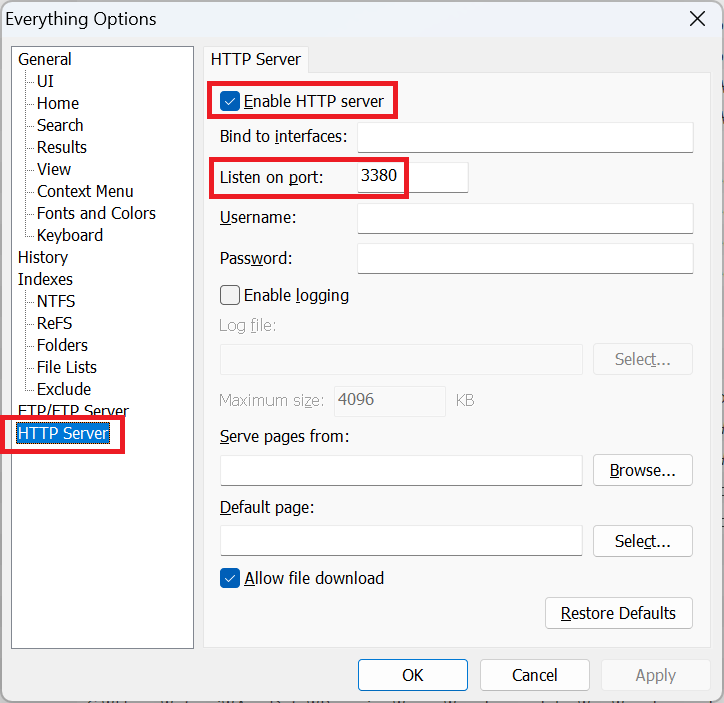
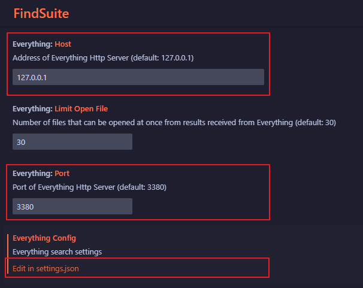

# FindSuite (RipGrep, Everything [Windows])

## Overview

This VS Code extension provides powerful file search capabilities right within your editor. With two main functions, it allows users to quickly find files on their computer using file names, file paths, and regular expressions. Additionally, it leverages ripgrep to efficiently locate files containing specific strings.

To search, press the shortcut key (e.g., Ctrl+F8 or Ctrl+F10) in the blank space or on the word you want to search. If you want to search for a folder name, press the shortcut key (Ctrl+Alt+4).

[Korean_한국어](README_KO.md)

## Prerequisites

Before using this extension, ensure that you have the following prerequisites installed:

- **Everything program**: The extension relies on the Everything program for fast file searches. Make sure it is installed on your system.

- **VSCode Settings**: Please enter the Host and Port configured in the Everything program. Also, configure the Everything Config.

## Features

### FindSuite Program

The first function, powered by the FindSuite program, enables users to swiftly locate files based on various search criteria such as file names, file paths, and regular expressions.

### Ripgrep Integration

The extension seamlessly integrates with ripgrep, allowing users to search for files containing specific strings efficiently.

## Shortcuts

- **Ctrl + F7**: Search for strings within the current file's folder using ripgrep.
- **Ctrl + F8**: Search for strings within the files in the current workspace using ripgrep.
- **Ctrl + Alt + 0**: Search for strings within the currently open file using ripgrep.

### Shortcut Keys (Requires Everything)

- **Ctrl + F10**: Search for files using Everything and then search within the selected file(s).
- **Ctrl + Alt + 4**: Search using Everything and open the selected folder(s).
- **Ctrl + Alt + F9**: Search for files using Everything.

## Usage

1. **Install Everything Program**: Ensure that the Everything program is installed on your system.
2. **Activate Extension**: Launch VS Code and activate the FindSuite extension.
3. **Perform File Search**:
   - Use the provided commands, shortcuts, or the VS Code command palette to initiate file searches.
   - Enter the desired search criteria such as file name, file path, or regular expression.
   - View search results directly within VS Code.

## Issues

Please let me know of any bugs via the issues page

## Release Notes

See [CHANGELOG.md](CHANGELOG.md)

## License

See [LICENSE](LICENSE) for more information.
