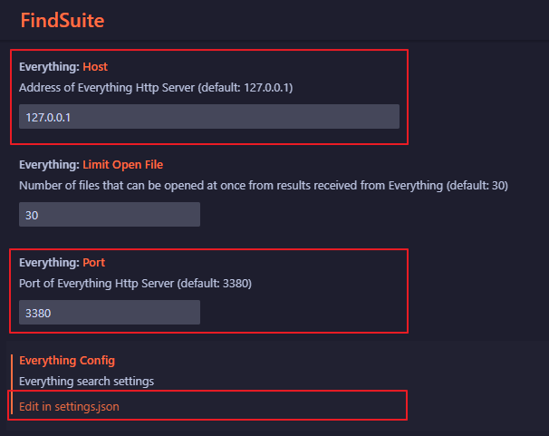

# FindSuite

[](https://marketplace.visualstudio.com/items?itemName=utocode.findsuite)
[](https://marketplace.visualstudio.com/items?itemName=utocode.findsuite)
[](https://github.com/codesuiteapp/findsuite/blob/master/LICENSE)

FindSuite는 VS Code 안에서 파일 검색, 텍스트 검색, 즐겨찾기, 비교, 문제 탐색을 빠르게 수행하도록 돕는 검색 보강 확장입니다. Ripgrep(`rg`), Fd(`fd`), Everything(Windows)을 VS Code Quick Pick 흐름에 연결해 워크스페이스 안팎의 파일과 문자열을 더 빠르게 찾을 수 있게 합니다.

## 주요 기능

- **Ripgrep 텍스트 검색**: 현재 파일, 현재 폴더, 워크스페이스, 즐겨찾기 경로, Fd/Everything 검색 결과 안에서 문자열 또는 정규식을 검색합니다.
- **Fd 파일/폴더 검색**: 워크스페이스와 사용자 지정 기본 경로에서 파일, 폴더, `.code-workspace` 파일을 찾고 바로 엽니다.
- **Everything 통합**: Windows에서 Everything HTTP 서버를 통해 시스템 전체 파일/폴더를 검색하고, 선택 결과를 열거나 Ripgrep 검색 대상으로 넘깁니다.
- **검색 파이프라인**: `fd | rg`, `everything | rg`처럼 먼저 파일/폴더 후보를 고른 뒤 그 안에서 텍스트를 검색합니다.
- **즐겨찾기**: 자주 여는 파일과 폴더를 저장하고, 즐겨찾기 안에서 검색하거나 파일을 빠르게 엽니다.
- **검색 히스토리**: Ripgrep 검색 결과를 세션 안에서 다시 열어 이전 검색 결과로 돌아갑니다.
- **비교와 문제 탐색**: 검색 결과 또는 열린 에디터 목록에서 파일 비교를 실행하고, VS Code Problems의 오류/경고를 Quick Pick으로 탐색합니다.

## 지원 도구

| 도구 | 용도 | 비고 |
| --- | --- | --- |
| Ripgrep | 파일 내용 텍스트 검색 | 내장 바이너리 사용 가능, 외부 프로그램 경로 설정 가능 |
| Fd | 파일/폴더 이름 검색 | 내장 바이너리 사용 가능, 외부 프로그램 경로 설정 가능 |
| Everything | Windows 시스템 전체 파일/폴더 검색 | Windows 전용, Everything HTTP 서버 필요 |

## 설치 및 준비

1. VS Code Marketplace에서 `FindSuite`를 설치합니다.
2. Windows에서 Everything 기능을 사용하려면 [Everything](https://www.voidtools.com/)을 설치하고 HTTP 서버를 활성화합니다.
3. VS Code 설정에서 `FindSuite`를 검색해 필요한 경로와 옵션을 조정합니다.

기본 설정값은 Everything 서버를 `127.0.0.1:3380`으로 가정합니다. Fd 기본 검색 경로는 플랫폼별 `findsuite.fd.path.*` 설정에 세미콜론(`;`)으로 구분해 등록할 수 있습니다.





## 주요 명령과 단축키

| 기능 | 명령 | 기본 단축키 |
| --- | --- | --- |
| 워크스페이스 텍스트 검색 | `FindSuite: Ripgrep in Workspace` | `Ctrl+Alt+F` |
| 현재 파일 텍스트 검색 | `FindSuite: Ripgrep in Current File` | `Ctrl+Alt+0` |
| 정규식 텍스트 검색 | `FindSuite: Ripgrep Using Regex` | 명령 팔레트 |
| 검색 히스토리 열기 | `FindSuite: Ripgrep in History List` | `Ctrl+Alt+Y` |
| Fd 파일 검색 | `FindSuite: Fd File` | `Ctrl+Alt+F7` |
| Fd 워크스페이스 파일 검색 | `FindSuite: Open files via Fd Workspace` | `Ctrl+Alt+9` |
| Fd 폴더 선택 후 파일 열기 | `FindSuite: Open files in Directory via Fd` | `Ctrl+Alt+M` |
| Fd 결과 안에서 Ripgrep | `FindSuite: Ripgrep via Fd` | `Ctrl+F7` |
| Fd 폴더 결과 안에서 Ripgrep | `FindSuite: Ripgrep via Fd Directory` | `Ctrl+Shift+F7` |
| 즐겨찾기 열기 | `FindSuite: Favorites List` | `Shift+F11` |
| 즐겨찾기 안에서 Ripgrep | `FindSuite: Ripgrep in Favorites` | `Ctrl+Shift+F11` |
| Everything 파일 검색 | `FindSuite: Everything` | `Ctrl+Alt+F9` |
| Everything 결과 안에서 Ripgrep | `FindSuite: Ripgrep via Everything` | `Ctrl+F10` |
| Everything 폴더 결과 안에서 Ripgrep | `FindSuite: Ripgrep via Everything Folder` | `Ctrl+Shift+F10` |
| Everything 폴더 열기 | `FindSuite: Open folder via Everything` | `Ctrl+Alt+4` |
| 파일 비교 | `FindSuite: Diff files via Fd` | `Ctrl+K Ctrl+Shift+D` |
| 문제 목록 보기 | `FindSuite: Show Problems in Files` | `Ctrl+Alt+]` |
| 다음/이전 문제 이동 | `FindSuite: Go to Next/Previous Problems` | `Ctrl+Alt+.` / `Ctrl+Alt+,` |

Everything 관련 명령은 Windows에서만 표시됩니다.

## 설정

자주 조정하는 설정은 다음과 같습니다.

- `findsuite.rg.defaultOption`: Ripgrep 기본 옵션입니다. 기본값은 `--hidden -S`입니다.
- `findsuite.rg.excludePatterns`: Ripgrep 검색에서 제외할 패턴 목록입니다.
- `findsuite.rg.count`: Ripgrep 결과 파일 수 제한입니다.
- `findsuite.fd.defaultOption`: Fd 기본 옵션입니다. 기본값은 `-H`입니다.
- `findsuite.fd.path.win32`, `findsuite.fd.path.darwin`, `findsuite.fd.path.linux`: Fd가 기본으로 검색할 경로 목록입니다.
- `findsuite.fd.excludePatterns`: Fd 검색에서 제외할 패턴 목록입니다.
- `findsuite.everything.host`, `findsuite.everything.port`: Everything HTTP 서버 연결 정보입니다.
- `findsuite.everything.count`: Everything 검색 결과 요청 수입니다.
- `findsuite.everything.limitOpenFile`: 다중 선택 결과를 열 때의 최대 파일 수입니다.
- `findsuite.everythingConfig`: Everything 커스텀 필터 정의입니다.
- `findsuite.category.favorites`: 즐겨찾기 파일 카테고리 목록입니다.
- `findsuite.compare.external.*`: 외부 비교 프로그램 사용 여부, 실행 파일, 옵션입니다.

## 개발

```bash
npm install
npm run compile
```

개발 중에는 다음 명령을 사용할 수 있습니다.

```bash
npm run watch
npm run lint
npm test
```

배포용 번들은 `npm run vscode:prepublish` 또는 `vsce package`로 준비합니다.

## 문서

- [역기획 PRD](docs/PRD.md)
- [변경 이력](CHANGELOG.md)
- [라이선스](LICENSE)
