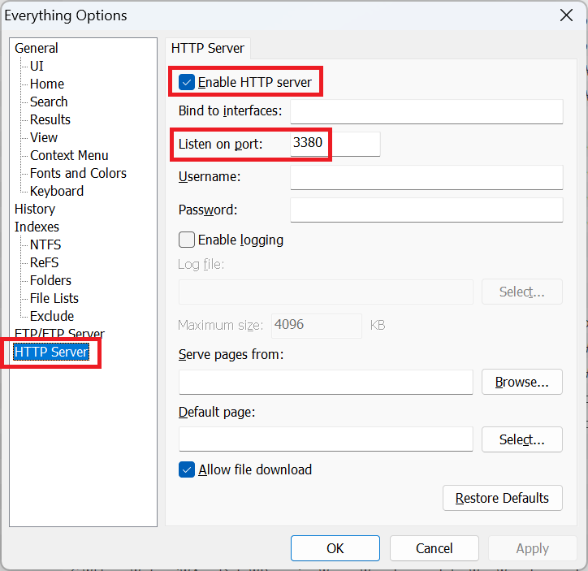
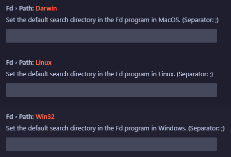

# FindSuite (RipGrep, Fd, Everything [Windows])

## 개요 (Overview)

**FindSuite**는 VS Code의 기본 검색 기능을 넘어, 시스템 전체를 아우르는 강력하고 빠른 검색 경험을 제공합니다.
**Ripgrep (rg)**, **Fd**, 그리고 **Everything** (Windows)과 같은 강력한 검색 도구들을 VS Code 내에 완벽하게 통합하여, 워크스페이스 내부는 물론 외부의 파일과 폴더, 텍스트까지 순식간에 찾아낼 수 있습니다.

VS Code의 기본 기능만으로는 부족했던 광범위한 파일 탐색과 텍스트 검색을 FindSuite로 해결하세요.

## 주요 기능 (Features)

### 1. Everything 통합 (Windows 전용)

Windows 사용자라면 필수적인 **Everything** 검색 엔진과 연동합니다.

- **초고속 파일/폴더 검색**: 시스템 전체의 파일과 폴더를 즉시 검색합니다.
- **파이프라인 검색**: `Everything | Ripgrep` 처럼, Everything으로 파일을 찾고 그 결과 내에서 Ripgrep으로 텍스트를 검색할 수 있습니다.
- **워크스페이스 관리**: 흩어져 있는 `.code-workspace` 파일들을 빠르게 찾아 프로젝트를 열 수 있습니다.

### 2. Fd 통합 (Cross-platform)

Linux, Mac, Windows 모두에서 사용할 수 있는 빠르고 사용자 친화적인 파일 검색 도구 **fd**를 지원합니다.

- **스마트한 파일 찾기**: `.gitignore`를 존중하며 빠르게 파일을 찾습니다.
- **디렉토리 기반 검색**: 특정 디렉토리를 검색하고, 그 안의 파일들을 열거나 텍스트를 검색할 수 있습니다.

### 3. Ripgrep (rg) 통합

가장 빠른 텍스트 검색 도구인 **Ripgrep**을 내장하여 VS Code에서 직접 활용합니다.

- **강력한 텍스트 검색**: 정규표현식 지원 및 압도적인 검색 속도를 자랑합니다.
- **유연한 범위**: 현재 파일, 열려있는 모든 파일, 워크스페이스, 혹은 특정 디렉토리 내에서 텍스트를 검색합니다.

### 4. 즐겨찾기 (Favorites)

자주 사용하는 파일이나 경로를 즐겨찾기에 등록하여 언제든 바로 접근하세요.

- **파일/경로 관리**: 자주 가는 파일이나 폴더를 그룹화하여 관리할 수 있습니다.
- **즐겨찾기 내 검색**: 즐겨찾기 등록된 경로 내에서만 텍스트를 검색할 수도 있습니다.

### 5. 문제 및 에러 탐색 (Problem Navigation)

- 파일 내의 에러나 경고 지점으로 빠르게 이동할 수 있는 네비게이션 기능을 제공합니다.

---

## 사전 준비 사항 (Prerequisites)

이 확장 프로그램을 100% 활용하기 위해 다음 도구들의 설치가 필요할 수 있습니다.

1.  **Everything (Windows 사용자)**:

    - [Everything 다운로드](https://www.voidtools.com/)
    - 설치 후 VS Code 설정에서 `Host`와 `Port`를 맞춰주세요. (기본값: 127.0.0.1:3380)
    - _참고: Everything의 HTTP 서버 기능이 활성화되어 있어야 할 수 있습니다._

    

2.  **Fd & Ripgrep**:

    - 확장 프로그램에 내장된 바이너리를 사용할 수 있으나, 시스템에 설치된 버전을 사용하려면 설정에서 경로를 지정하세요.
    - **Fd 설정**: 자주 검색할 기본 경로들을 `Findsuite > Fd > Path` 설정에 등록해두면 편리합니다. (예: `C:\workspace;D:\projects`)

    

---

## 사용법 및 단축키 (Usage & Shortcuts)

### 🔍 Everything (Windows)

| 단축키                       | 명령어              | 설명                                        |
| :--------------------------- | :------------------ | :------------------------------------------ | ----------------------------------------------------------- |
| **Ctrl + Alt + F9**          | `Everything`        | 시스템 전체 파일 검색                       |                                                             |
| **Ctrl + F10**               | `Everything`        | rg                                          | Everything으로 파일 검색 후, 선택한 파일 내에서 텍스트 검색 |
| **Ctrl + Shift + F10**       | `Everything Folder` | rg                                          | Everything으로 폴더 검색 후, 해당 폴더 내에서 텍스트 검색   |
| **Ctrl + Alt + 4**           | `Everything Folder` | 폴더를 검색하여 VS Code에서 열기            |                                                             |
| **Ctrl + Alt + Shift + w**   | `Code Workspace`    | `.code-workspace` 파일을 찾아 프로젝트 열기 |                                                             |
| **Ctrl + k, Ctrl + Alt + d** | `Everything Diff`   | 두 파일을 검색하여 비교(Diff) 하기          |                                                             |

### 📂 Fd (File Search)

| 단축키                         | 명령어         | 설명                                                |
| :----------------------------- | :------------- | :-------------------------------------------------- | ------------------------------------------------------- |
| **Ctrl + Alt + 9**             | `Fd Workspace` | 현재 워크스페이스 내 모든 파일 검색                 |                                                         |
| **Ctrl + Alt + F7**            | `Fd File`      | 설정된 기본 경로 + 현재 프로젝트에서 파일 검색      |                                                         |
| **Ctrl + Alt + m**             | `Fd Folder`    | 디렉토리를 검색하고, 해당 디렉토리 내의 파일들 열기 |                                                         |
| **Ctrl + F7**                  | `Fd`           | rg                                                  | Fd로 파일 검색 후, 선택한 파일 내에서 텍스트 검색       |
| **Ctrl + Shift + F7**          | `Fd Directory` | rg                                                  | Fd로 디렉토리 검색 후, 해당 디렉토리 내에서 텍스트 검색 |
| **Ctrl + k, Ctrl + Shift + d** | `Fd Diff`      | Fd로 파일을 찾아 비교(Diff) 하기                    |

### 📝 Ripgrep (Text Search)

| 단축키             | 명령어            | 설명                                   |
| :----------------- | :---------------- | :------------------------------------- |
| **Ctrl + Alt + f** | `Rg Workspace`    | 현재 워크스페이스 전체에서 텍스트 검색 |
| **Ctrl + Alt + 0** | `Rg Current File` | 현재 열려있는 파일 내에서 텍스트 검색  |
| **Ctrl + Alt + y** | `Rg History`      | 이전에 검색했던 기록을 다시 검색       |

### ⭐ 즐겨찾기 (Favorites)

| 단축키                 | 명령어           | 설명                                      |
| :--------------------- | :--------------- | :---------------------------------------- |
| **Shift + F11**        | `Favorites List` | 즐겨찾기 목록 보기 및 이동                |
| **Ctrl + Shift + F11** | `Rg Favorites`   | 즐겨찾기 등록된 경로들 내에서 텍스트 검색 |
| **Alt + Shift + p**    | `Favorites File` | 즐겨찾기된 파일만 검색하여 열기           |

### 🚨 에러 탐색 (Error Navigation)

| 단축키               | 명령어        | 설명                       |
| :------------------- | :------------ | :------------------------- |
| **Ctrl + Alt + F12** | `Show Errors` | 현재 파일의 에러 목록 보기 |
| **Alt + .**          | `Next Error`  | 다음 에러/문제로 이동      |
| **Alt + ,**          | `Prev Error`  | 이전 에러/문제로 이동      |

---

## 설정 (Configuration)

VS Code 설정(`Ctrl+,`)에서 `FindSuite`를 검색하여 다양한 옵션을 조정할 수 있습니다.

- **findsuite.everythingConfig**: Everything 검색 시 사용할 커스텀 필터(쿼리)를 정의합니다. (예: 특정 확장자만 검색 등)
- **findsuite.category.favorites**: 즐겨찾기 카테고리를 관리합니다.
- **findsuite.rg.matchColor**: 검색 결과에서 매칭된 텍스트의 하이라이트 색상을 테마별(Dark/Light)로 지정합니다.
- **findsuite.fd.excludePatterns**: Fd 검색 시 제외할 패턴을 설정합니다.

## 문제 해결 (Issues)

버그나 제안 사항이 있다면 [Issues](https://github.com/codesuiteapp/findsuite/issues) 페이지에 남겨주세요.

## 라이선스 (License)

자세한 내용은 [LICENSE](LICENSE) 파일을 참조하세요.
